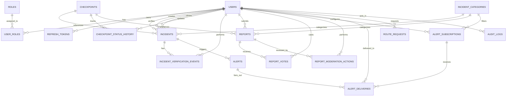

# Wasel Palestine ERD (Core Tables)

## Scope
- This ERD focuses on logical relationships needed for course deliverables.
- Exact field types and constraints remain source-of-truth in SQLAlchemy models and Alembic migration files.
