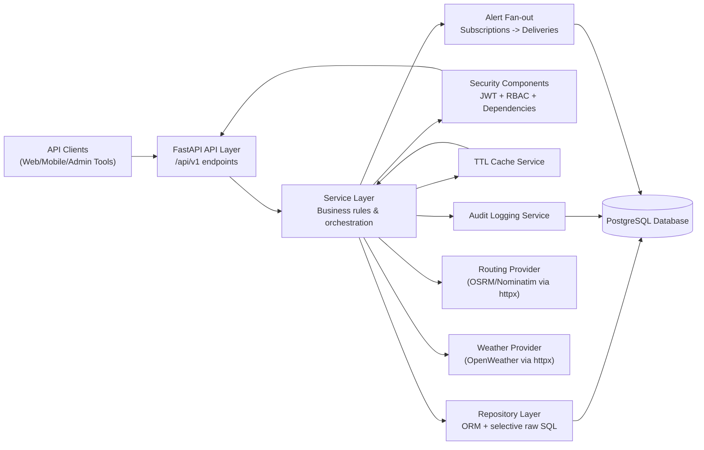

# Wasel Palestine Architecture Diagram

## Layer Notes
- API routers stay thin and delegate all business decisions to services.
- Services enforce moderation, deduplication, verification, alert generation, and audit logging.
- Repository/database access remains isolated from endpoint code.
- External providers are accessed through integration clients with timeout, retry, throttle, and cache controls.
